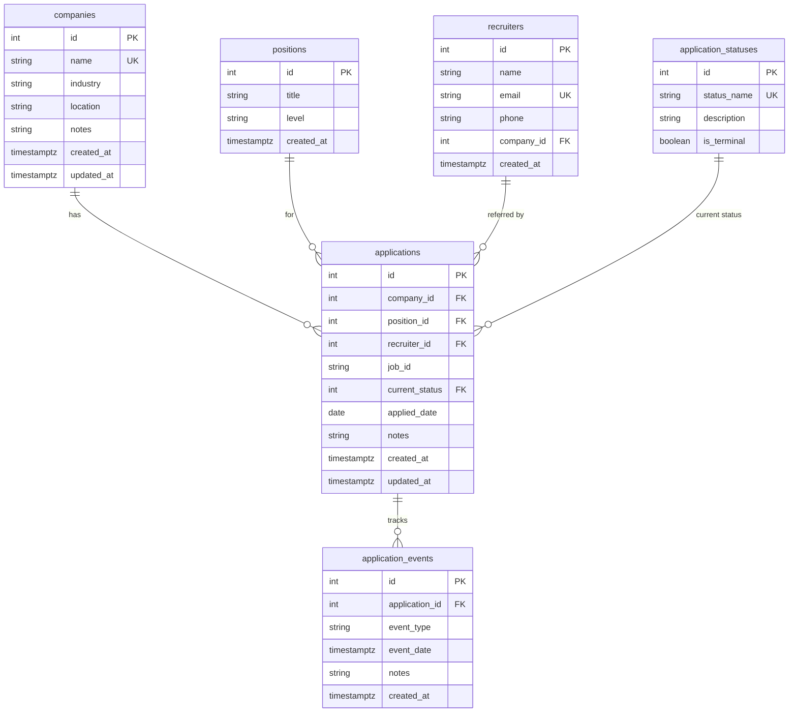

# Database Schema

## Entity Relationship Diagram



## Tables

### companies
Stores employer information.

**Columns:**
- `id` - Auto-incrementing primary key
- `name` - Company name (unique, case-insensitive)
- `industry` - Industry sector (nullable)
- `location` - Geographic location (required)
- `notes` - Additional information (nullable)
- `created_at`, `updated_at` - Timestamps

**Constraints:**
- Cannot delete company if applications exist (RESTRICT)

### positions
Job position titles and levels.

**Columns:**
- `id` - Auto-incrementing primary key
- `title` - Position title (e.g., "Software Engineer")
- `level` - Seniority level (Entry, Junior, Mid, Senior, Lead, Manager)
- `created_at` - Timestamp

**Valid Levels:** Entry, Intern, Junior, Mid, Senior, Lead, Manager

### applications
Core table tracking job applications.

**Columns:**
- `id` - Auto-incrementing primary key
- `company_id` - Foreign key to companies (required)
- `position_id` - Foreign key to positions (required)
- `recruiter_id` - Foreign key to recruiters (nullable)
- `job_id` - External posting/job board ID (nullable, max 100 chars)
- `current_status` - Foreign key to application_statuses (required)
- `applied_date` - Date application was submitted (defaults to today)
- `notes` - Additional notes (nullable)
- `created_at`, `updated_at` - Timestamps

**Constraints:**
- `job_id` must be non-empty if provided
- `applied_date` cannot be in the future
- `applied_date` must be within last 365 days
- Cannot delete referenced companies or positions (RESTRICT)
- Deleting recruiter sets `recruiter_id` to NULL

### application_events
Timeline of events for each application (audit log).

**Columns:**
- `id` - Auto-incrementing primary key
- `application_id` - Foreign key to applications (required)
- `event_type` - Type of event (e.g., "Interview Scheduled")
- `event_date` - When the event occurred (defaults to now)
- `notes` - Event details (nullable)
- `created_at` - Timestamp

**Constraints:**
- `event_date` cannot be in the future
- Events are deleted when parent application is deleted (CASCADE)
- Events are immutable (insert-only)

### recruiters
Contact information for recruiters or references.

**Columns:**
- `id` - Auto-incrementing primary key
- `name` - Recruiter name (required)
- `email` - Email address (unique, nullable)
- `phone` - Phone number (nullable)
- `company_id` - Associated company (nullable)
- `created_at` - Timestamp

### application_statuses
Reference table of valid application statuses.

**Columns:**
- `id` - Auto-incrementing primary key
- `status_name` - Status name (unique)
- `description` - Status description (nullable)
- `is_terminal` - Whether this is a final state (boolean)

**Valid Statuses:**
- Applied
- Interview Scheduled
- Interviewed
- Offer
- Accepted (terminal)
- Rejected (terminal)
- Withdrawn (terminal)

## State Machine

Applications progress through defined states. Terminal states (Accepted, Rejected, Withdrawn) are final.

**Valid Transitions:**
```
Applied → Interview Scheduled, Rejected, Withdrawn
Interview Scheduled → Interviewed, Rejected
Interviewed → Offer, Rejected
Offer → Accepted, Rejected
```

## Indexes

Performance indexes for common queries:

- `applications.company_id` - Find all applications to a company
- `applications.position_id` - Find all applications for a position
- `applications.current_status` - Filter by status
- `applications.applied_date` - Date range queries
- `applications.job_id` - Lookup by external posting ID
- `application_events.application_id` - Event timeline lookup
- `application_events.event_date` - Temporal analysis

## Foreign Key Rules

| Relationship | On Delete |
|-------------|-----------|
| applications -> companies | RESTRICT |
| applications -> positions | RESTRICT |
| applications -> recruiters | SET NULL |
| applications -> application_statuses | RESTRICT |
| application_events -> applications | CASCADE |
| recruiters -> companies | SET NULL |

**RESTRICT:** Prevents deletion if dependencies exist
**CASCADE:** Automatically deletes dependent rows
**SET NULL:** Sets foreign key to NULL when parent is deleted

## Database Layer (Python)

### Module Structure
- `job_tracker/database/connection.py` - Connection lifecycle + context manager
- `job_tracker/database/query_executor.py` - Parameterized queries + cursor management
- `job_tracker/database/transaction.py` - Transaction + savepoint handling
- `job_tracker/database/exceptions.py` - Custom exceptions and error mapping
- `job_tracker/database/init_db.py` - Schema application and reference data seeding

### Logging Configuration
- Use `job_tracker/utils/logger.py` and call `setup_logging()` once at startup.
- Optional file logging: set `LOG_FILE` env var or pass `log_file` directly.

### Connection Manager Example
```python
from job_tracker.utils.config import Config
from job_tracker.database.connection import DatabaseConnection

config = Config()
with DatabaseConnection(config.get_connection_string()) as db:
    rows = db.execute_query("SELECT 1", fetch=True)
```

### Query Executor Example
```python
from job_tracker.database.query_executor import QueryExecutor

executor = QueryExecutor(db.connection)
rows = executor.execute_query("SELECT * FROM companies WHERE id = %s", (1,))
```

### Transaction Manager Example
```python
from job_tracker.database.transaction import TransactionManager

with TransactionManager(db) as tx:
    executor.execute_update("UPDATE companies SET notes = %s WHERE id = %s", ("Updated", 1))
```

### Error Handling Example
```python
from job_tracker.database.exceptions import DatabaseError

try:
    executor.execute_query("SELECT * FROM missing_table")
except DatabaseError as exc:
    print(f"Database error: {exc}")
```
